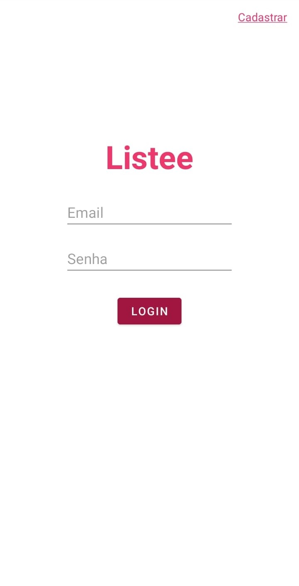
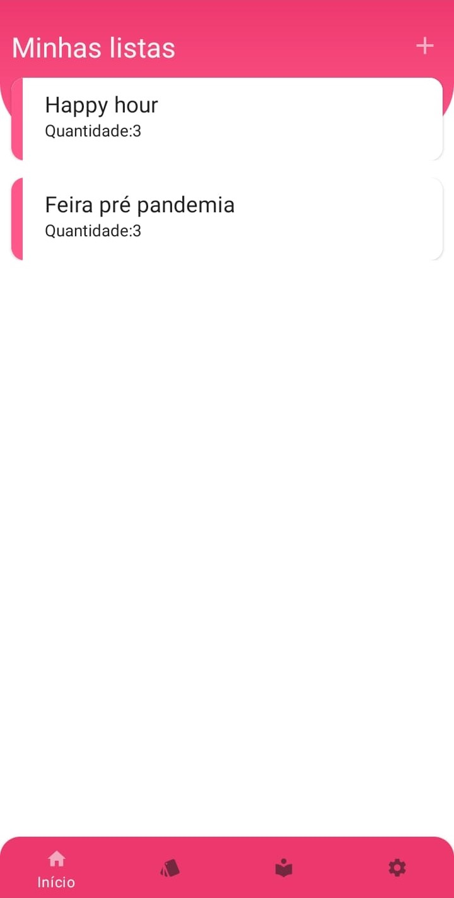
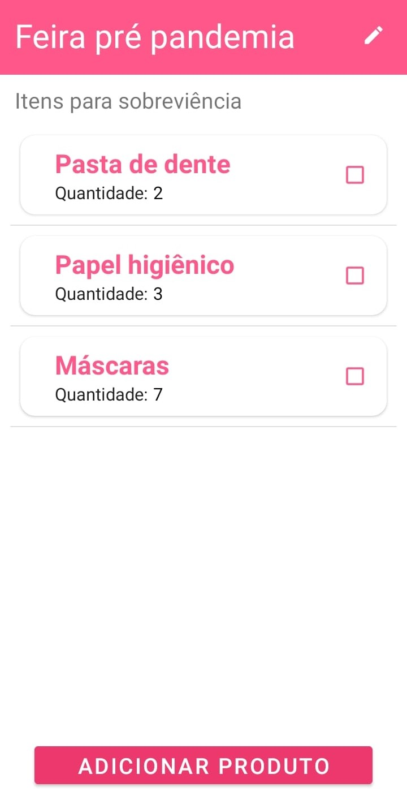
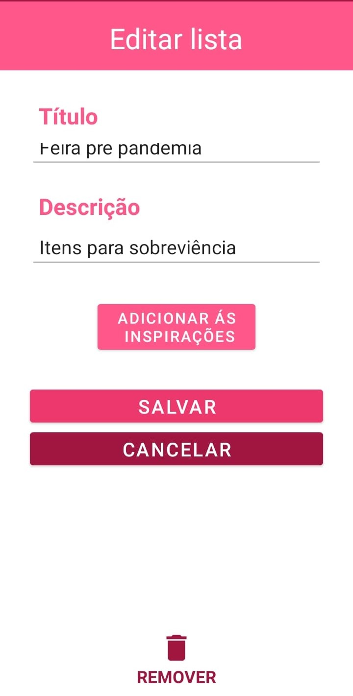
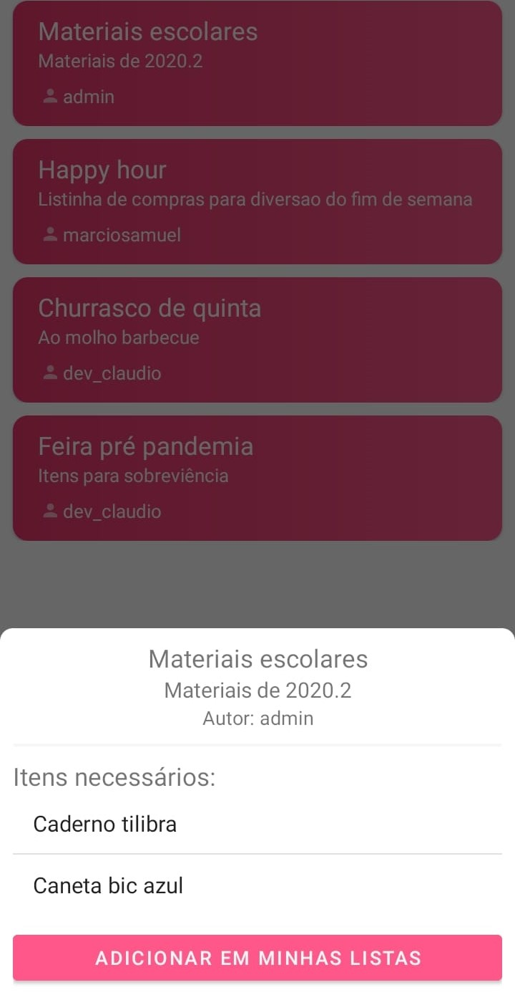

<h1 align="center">
    
    
Listee

</h1>

Listee é um aplicativo de lista de compras desenvolvido para a matéria de Laboratório de Programação para Dispositivos Móveis e Sem Fio do curso de Análise e Desenvolvimento de Sistemas.

Nele é possível gerenciar suas listas de compras, estoque e seus dados de usuário, além de existir uma aba de inspirações, onde qualquer usuário pode compartilhar sua lista.

<h2>Tecnologias</h2>

As seguintes ferramentas foram utilizadas na construção do projeto:

    
    
    

<h2>Licença</h2>

Este projeto está sob licença do MIT que permite a qualquer pessoa que obtém uma cópia do software e seus arquivos de documentação associados poder lidar com eles sem restrição ou limitação aos direitos de uso. As condições impostas são de apenas manter o aviso de copyright e uma cópia da <a href="https://github.com/marciosamuel/listee/blob/main/LICENSE">licença</a> em todas as reproduções do software.

<h2>Screenshots</h2>

    
    
    
    
    

<h2>Como instalar</h2>

<b align="center">Aplicativo compatível apenas com android 11+</b>

<ol>
    <li>Vá para a página de <a href="">releases</a> e baixe o arquivo <b>listee.apk</b>.</li>
    <li>Abra o arquivo no seu dispositivo android e instale.</li>
    <li>Se tiver dúvidas, siga o passo a passo deste <a href="https://geekblog.com.br/como-instalar-apk-no-android-8-9-e-10/">link.</a></li>
</ol>
